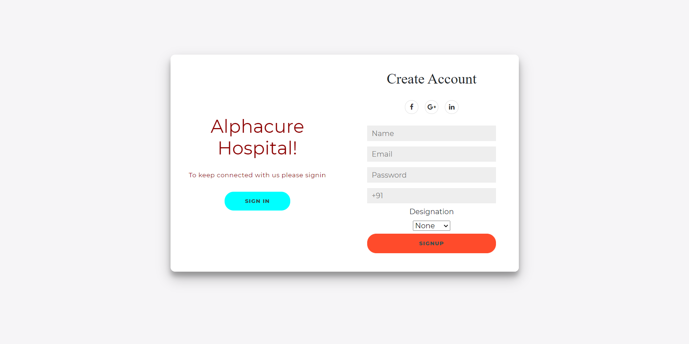
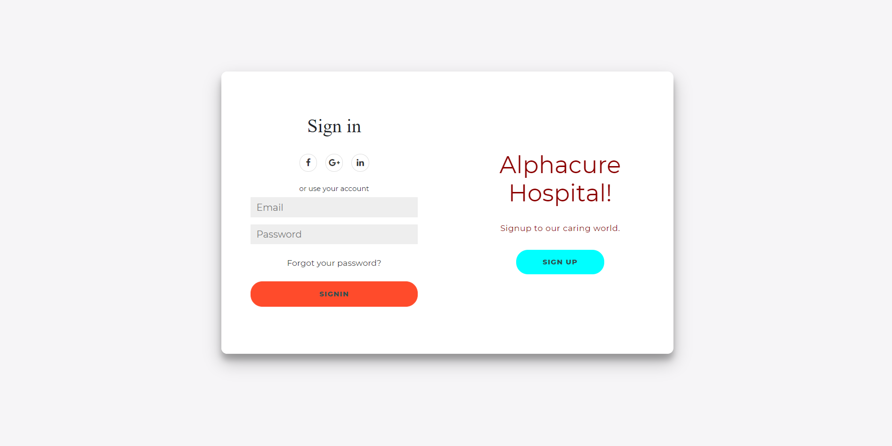
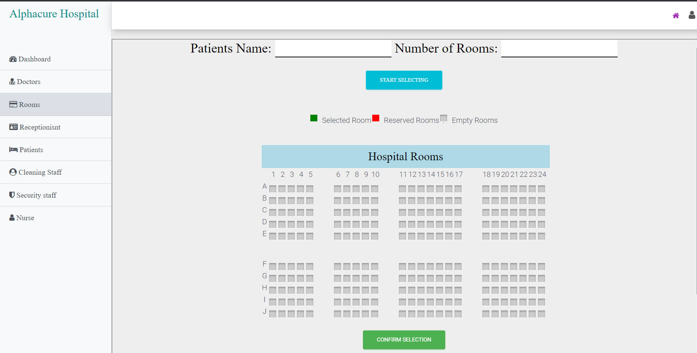

<h1>Hospital-Management-System</h1>
<h3>A Java based dynamic web application using servlet (JDBC - Servlet) to manage the hospital staffs , doctors, patients.</h3>

 
  A dynamic Web Portal used for Hospital Management to perform operations regarding staffs , doctors , patients , receptionist , security staff , cleaning staffs , nurses.
  A fully secured and email verified login and signup.
  Facility to book a room , make an appointment. 

 Here are some of the views of project below 

 

  
  
  
  
  
  

